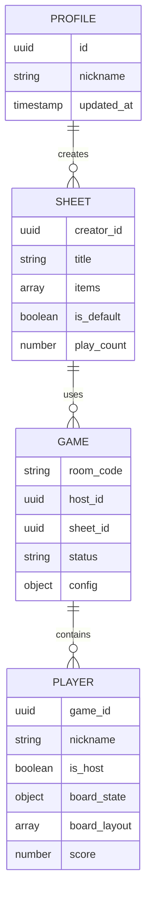

# 🏓 Pingo — Developer Guide

> **One-stop onboarding reference.** Covers everything a new developer needs to
> go from a fresh clone to a running local environment, through running tests,
> to pushing a production deployment.

---

## 📋 Table of Contents

1. [Prerequisites](#1-prerequisites)
2. [Clone & Install](#2-clone--install)
3. [Environment Setup](#3-environment-setup)
4. [Running Locally](#4-running-locally)
5. [Running Tests](#5-running-tests)
6. [AI Agent & Checklist](#6-ai-agent--checklist)
7. [Project Structure](#7-project-structure)
8. [Convex Backend](#8-convex-backend)
9. [Deployment](#9-deployment)
10. [Troubleshooting](#10-troubleshooting)

---

## 1. Prerequisites

| Tool           | Version    | Install                                   |
| -------------- | ---------- | ----------------------------------------- |
| **Node.js**    | 20+        | [nodejs.org](https://nodejs.org)          |
| **npm**        | 10+        | Bundled with Node.js                      |
| **Convex CLI** | Latest     | `pnpm add -g convex` _(or use `npx convex`)_ |
| **Git**        | Any modern | [git-scm.com](https://git-scm.com)        |
| **Python**     | 3.10+      | Required for `.agent/` audit scripts      |

> **Windows users**: All commands in this guide use **PowerShell**. Run
> terminals as a regular user (admin is not required).

---

## 2. Clone & Install

```powershell
# Clone the repository
git clone <your-repo-url>
cd pingo

# Install all npm dependencies (frontend + dev tools)
pnpm install
```

This installs:

- React 18, Vite, Tailwind CSS, Framer Motion
- Convex client (`convex`, `@convex-dev/auth`)
- Testing tools (`vitest`, `@testing-library/react`, `jsdom`)
- Linting (`eslint`, `typescript-eslint`)

---

## 3. Environment Setup

### 3.1 Frontend Environment Variables

Copy the example file and fill in your Convex URL:

```powershell
# For local development
Copy-Item .env.development.example .env.local
```

Edit `.env.local`:

```env
# Paste the URL printed by `npx convex dev` on first run
VITE_CONVEX_URL=http://127.0.0.1:3210
```

For **staging/dev** targets, use:

```env
VITE_CONVEX_URL=https://combative-mouse-848.convex.cloud
```

> ⚠️ **Never commit** `.env.local` — it is in `.gitignore`.

### 3.2 Backend (Convex) Setup — First Time Only

```powershell
# This logs you in, creates a project, and generates auth keys automatically.
# Answer the prompts:
#   - Project name: pingo
#   - SITE_URL: http://localhost:5173
npx convex dev
```

After this runs, your `convex/.env.local` is auto-created. The terminal will
print:

```
✔  Convex functions ready!  →  http://127.0.0.1:3210
```

Copy that URL into your root `.env.local` as `VITE_CONVEX_URL`.

### 3.3 Backend Auth Keys — First Time Setup

Pingo uses `@convex-dev/auth`. Run:

```powershell
npx @convex-dev/auth
```

When prompted for `SITE_URL`, enter `http://localhost:5173`.

> **Windows / Node v24 workaround**: If this CLI crashes, generate the keys
> manually:
>
> ```powershell
> node -e "const c=require('crypto');const{publicKey,privateKey}=c.generateKeyPairSync('rsa',{modulusLength:2048,publicKeyEncoding:{type:'spki',format:'pem'},privateKeyEncoding:{type:'pkcs8',format:'pem'}});const jwk=c.createPublicKey(publicKey).export({format:'jwk'});const jwks=JSON.stringify({keys:[{...jwk,use:'sig',alg:'RS256',kid:'default'}]});console.log('JWT_PRIVATE_KEY:\n'+privateKey+'\nJWKS:\n'+jwks)"
> ```
>
> Then paste `JWKS` and `JWT_PRIVATE_KEY` into the Convex Dashboard under
> **Settings → Environment Variables**.

### 3.4 Google OAuth (Optional for local, required for staging/prod)

Pingo uses a **single Google OAuth client** across all environments. See
[ENV_SETUP.md § Google OAuth](./ENV_SETUP.md#-2-google-oauth-configuration)
for the full redirect URI list. The same `AUTH_GOOGLE_ID` and
`AUTH_GOOGLE_SECRET` are set on every Convex deployment:

```powershell
npx convex env set AUTH_GOOGLE_ID <your-client-id>
npx convex env set AUTH_GOOGLE_SECRET <your-client-secret>
```

---

## 4. Running Locally

You need **two terminals** running simultaneously:

**Terminal 1 — Convex backend:**

```powershell
npx convex dev
```

**Terminal 2 — Vite frontend:**

```powershell
pnpm run dev
```

Open **[http://localhost:5173](http://localhost:5173)** in your browser.

> The Convex dev server runs at `http://127.0.0.1:3210` (data API) and
> `http://127.0.0.1:3211` (site/auth). Both must be running for auth to work.

### Available npm scripts

| Command                 | Description                                    |
| ----------------------- | ---------------------------------------------- |
| `pnpm run dev`           | Start local Vite dev server with HMR           |
| `pnpm run build`         | TypeScript check + production build to `dist/` |
| `pnpm run preview`       | Preview the production build locally           |
| `pnpm run test`          | Run Vitest in watch mode                       |
| `pnpm run test:coverage` | Run all tests once + generate coverage report  |
| `pnpm run test:e2e`      | Run all Playwright E2E tests                   |
| `pnpm run test:e2e:ui`   | Run Playwright tests with tracing UI           |
| `pnpm run lint`          | Run ESLint (zero warnings policy)              |

---

## 5. Running Tests

Pingo uses **Vitest** + **React Testing Library** for unit/component tests, and
is set up for **Playwright** E2E tests.

### 5.1 Unit & Component Tests

```powershell
# Watch mode (re-runs on file save — use during development)
pnpm run test

# Single run (used in CI)
npx vitest run

# With coverage report
pnpm run test:coverage
```

Coverage output appears in the terminal table and in `coverage/` (open
`coverage/index.html` for the visual report).

**Current coverage baseline (as of Phase 17A):**

| Layer         | Statements | Branches | Functions | Lines |
| ------------- | ---------- | -------- | --------- | ----- |
| All files     | 79.9%      | 79.7%    | 80.6%     | 82.4% |
| `hooks/`      | 100%       | 100%     | 100%      | 100%  |
| `components/` | 100%       | 89%      | 100%      | 100%  |
| `lib/`        | 100%       | 100%     | 100%      | 100%  |
| `pages/`      | 74%        | 75%      | 72%       | 77%   |

**Target**: ≥ 70% (minimum) · ≥ 85% (goal)

### 5.2 Test Files Location

Test files live next to the source files they test, using the `.test.tsx` /
`.test.ts` suffix:

```
src/
├── pages/
│   ├── LobbyPage.tsx
│   └── LobbyPage.test.tsx    ← 8 tests
│   ├── HomePage.tsx
│   └── HomePage.test.tsx     ← 3 tests
│   ├── JoinPage.tsx
│   └── JoinPage.test.tsx     ← 5 tests
├── components/
│   ├── PopularSheets.tsx
│   └── PopularSheets.test.tsx ← 5 tests
│   ├── ErrorDialog.tsx
│   └── ErrorDialog.test.tsx   ← 4 tests
│   ├── SheetPreviewModal.tsx
│   └── SheetPreviewModal.test.tsx ← 3 tests
└── hooks/
    ├── use-pingo-auth.ts
    └── use-pingo-auth.test.ts  ← 5 tests
    ├── useSessionTimeout.ts
    └── useSessionTimeout.test.ts ← 3 tests
```

### 5.3 Writing New Tests

Follow these conventions:

```typescript
// src/pages/ExamplePage.test.tsx
import { beforeEach, describe, expect, it, vi } from "vitest";
import { fireEvent, render, screen, waitFor } from "@testing-library/react";
import { MemoryRouter, Route, Routes } from "react-router-dom";

// Mock Convex hooks — pattern used throughout the project
vi.mock("convex/react", () => ({
  useQuery: vi.fn(),
  useMutation: vi.fn(),
}));

// Mock the generated API (strings act as type-safe keys in tests)
vi.mock("../../convex/_generated/api", () => ({
  api: {
    games: { getWithSheet: "mock-getWithSheet" },
  },
}));
```

### 5.4 E2E Tests (Playwright)

Pingo employs Playwright for high-fidelity End-to-End (E2E) UI testing across
Chrome, Firefox, and Safari.

### Preparing the Convex Backend for E2E Tests

Before running E2E tests, it's highly recommended to start with a clean Convex
development database to avoid test flakiness caused by leftover data from
previous tests or manual testing.

Since `npx convex dev --reset` is not always available, you can reset your local
Convex dev environment by:

1. Stopping your `npx convex dev` process.
2. Deleting the local SQLite database directory:
   ```powershell
   Remove-Item -Recurse -Force convex/.convex
   ```
3. Restarting the `npx convex dev` server.

Run E2E tests with the following commands. **Note**: These commands
automatically manage the backend and frontend dev servers using the
configuration in `playwright.config.ts`, so you don't need to have them running
beforehand.

```powershell
# Run all E2E tests in the background (headless)
pnpm run test:e2e

# Run with the Playwright UI (helpful for debugging)
pnpm run test:e2e:ui
```

E2E test files live in the `e2e/` directory:

```
e2e/
├── home.spec.ts             ← home page routing tests
└── multiplayer.spec.ts      ← host and guest game flow tests
```

---

## 6. AI Agent & Checklist

The `.agent/` directory contains the AI-assisted development configuration and
audit scripts.

### 6.1 Running the Quality Checklist

The checklist runs a suite of automated audits across Security, Lint, Schema,
Tests, UX, SEO, and Performance.

```powershell
# Run full project audit
python .agent/scripts/checklist.py .

# Run with Lighthouse/E2E (requires running dev server)
python .agent/scripts/checklist.py . --url http://localhost:5173
```

**Execution order:** Security → Lint → Schema → Tests → UX → SEO → Bundle → E2E

### 6.2 Individual Audit Scripts

Located in `.agent/skills/<skill>/scripts/`:

| Script                     | What it checks                           |
| -------------------------- | ---------------------------------------- |
| `security_scan.py`         | Hardcoded secrets, dependency CVEs       |
| `dependency_analyzer.py`   | Outdated packages, known vulnerabilities |
| `lint_runner.py`           | ESLint + TypeScript errors               |
| `test_runner.py`           | Vitest run + coverage thresholds         |
| `schema_validator.py`      | Convex schema consistency                |
| `ux_audit.py`              | Form labels, contrast, focus traps       |
| `accessibility_checker.py` | ARIA roles, semantic HTML                |
| `seo_checker.py`           | Meta tags, title hierarchy, Open Graph   |
| `bundle_analyzer.py`       | Bundle size, code splitting              |
| `lighthouse_audit.py`      | Core Web Vitals                          |
| `playwright_runner.py`     | E2E test execution                       |

Run any script individually:

```powershell
python .agent/skills/vulnerability-scanner/scripts/security_scan.py .
python .agent/skills/frontend-design/scripts/ux_audit.py .
```

---

## 7. Project Structure

```
pingo/
├── src/
│   ├── pages/           # Route-level views (9 routes)
│   │   ├── HomePage.tsx
│   │   ├── CreatePage.tsx
│   │   ├── JoinPage.tsx
│   │   ├── LobbyPage.tsx
│   │   ├── GamePage.tsx
│   │   ├── SheetsPage.tsx
│   │   ├── ProfilePage.tsx
│   │   ├── SignInPage.tsx
│   │   └── SignUpPage.tsx
│   ├── components/      # Shared UI components
│   │   ├── ErrorDialog.tsx
│   │   ├── PopularSheets.tsx
│   │   └── SheetPreviewModal.tsx
│   ├── hooks/           # Custom React hooks
│   │   ├── use-pingo-auth.ts    # Auth state wrapper
│   │   └── useSessionTimeout.ts # Lobby auto-expire
│   ├── lib/             # Utility functions
│   │   └── utils.ts     # cn() & helpers
│   ├── types/           # TypeScript interfaces
│   └── setupTests.ts    # Vitest global setup
│
├── convex/              # All backend code (Convex functions)
│   ├── schema.ts        # Database schema (game, player, sheet, profile)
│   ├── auth.ts          # Auth configuration
│   ├── games.ts         # Game mutations & queries
│   ├── players.ts       # Player mutations & queries
│   ├── sheets.ts        # Sheet mutations & queries
│   └── _generated/      # Auto-generated — do not edit
│
├── public/
│   └── _redirects       # Cloudflare SPA routing (/* /index.html 200)
│
├── .agent/              # AI development configuration
│   ├── agents/          # Specialist agent definitions
│   ├── skills/          # Skill modules + audit scripts
│   ├── workflows/       # Slash command workflows
│   └── scripts/         # Master checklist runner
│
├── .env.local           # Local secrets — NOT committed
├── .env.development.example  # Template for staging env
├── .env.production.example   # Template for production env
├── vite.config.ts       # Vite + Vitest configuration
├── tailwind.config.ts   # Tailwind configuration
├── tsconfig.json        # TypeScript (strict mode)
├── DEVELOPER_GUIDE.md   # ← You are here
├── ENV_SETUP.md         # Detailed environment matrix
├── DEPLOYMENT.md        # Deployment history & troubleshooting
└── task_plan.md         # Project task board
```

### Routes

| Route        | Component     | Notes                                         |
| ------------ | ------------- | --------------------------------------------- |
| `/`          | `HomePage`    | Landing page — host or join                   |
| `/create`    | `CreatePage`  | Select sheet, launch lobby                    |
| `/join`      | `JoinPage`    | Enter room code + nickname; supports `?code=` |
| `/lobby/:id` | `LobbyPage`   | Waiting room before start                     |
| `/game/:id`  | `GamePage`    | Live bingo board                              |
| `/sheets`    | `SheetsPage`  | Manage custom sheets                          |
| `/profile`   | `ProfilePage` | Auth required                                 |
| `/signin`    | `SignInPage`  | Email + Google                                |
| `/signup`    | `SignUpPage`  | Register                                      |

---

## 8. Convex Backend

All backend logic lives in `convex/`. Changes to functions are **hot-reloaded**
while `npx convex dev` is running.

### Schema overview (`convex/schema.ts`)

| Table     | Key Fields                                                                           |
| --------- | ------------------------------------------------------------------------------------ |
| `game`    | `room_code`, `host_id`, `sheet_id`, `status` (`lobby`/`active`/`finished`), `config` |
| `player`  | `game_id`, `nickname`, `is_host`, `board_state`, `board_layout`, `score`             |
| `sheet`   | `creator_id`, `title`, `items[]`, `is_default`, `play_count`                         |
| `profile` | `id` (auth UID), `nickname`, `updated_at`                                            |

### Schema Entity Relationship Diagram



### Key Convex functions

```
convex/
├── games.ts
│   ├── getWithSheet   ← query: game + sheet joined
│   ├── getByCode      ← query: look up by room code
│   ├── create         ← mutation: create a new game
│   ├── start          ← mutation: host-only; changes status → active
│   └── end            ← mutation: host-only; changes status → finished
├── players.ts
│   ├── getForGame     ← query: all players in a game
│   ├── join           ← mutation: add player to game
│   ├── updateBoard    ← mutation: host assigns board layout on start
│   └── markCell       ← mutation: player marks a cell
└── sheets.ts
    ├── getPopular     ← query: top sheets by play_count
    ├── getMine        ← query: sheets owned by current user
    ├── create         ← mutation
    └── delete         ← mutation
```

### Pushing to Convex Cloud

```powershell
# Deploy to dev/staging environment
npx convex deploy

# Deploy to production
npx convex deploy --prod
```

---

## 9. Deployment

### 9.1 Backend — Convex Cloud

```powershell
# Production deploy
npx convex deploy --prod
```

The Convex dashboard is at
[dashboard.convex.dev](https://dashboard.convex.dev).\
Production deployment URL: `https://fearless-axolotl-554.convex.cloud`

### 9.2 Frontend — Cloudflare Pages

The frontend is deployed automatically via **GitHub CI** on every push to
`main`.

**Cloudflare Pages settings:**

| Setting                       | Value                                       |
| ----------------------------- | ------------------------------------------- |
| Framework preset              | Vite                                        |
| Build command                 | `pnpm run build`                             |
| Build output directory        | `dist`                                      |
| `VITE_CONVEX_URL` (prod)      | `https://fearless-axolotl-554.convex.cloud` |
| `CONVEX_DEPLOY_KEY` (preview) | See Convex Dashboard → Deploy Keys          |

**Manual deploy from local:**

```powershell
pnpm run build
# Then upload `dist/` in the Cloudflare Pages dashboard manually,
# or use wrangler:
npx wrangler pages deploy dist --project-name pingo
```

### 9.3 Preview Environments

For branch-based previews, the Cloudflare **Preview** build command is:

```bash
npx convex deploy --cmd "pnpm run build" --cmd-url-env-var-name VITE_CONVEX_URL
```

This auto-provisions a Convex preview backend and injects its URL into the
build.

**Stable staging backend** (avoid changing Google OAuth redirects for every
branch):

```bash
npx convex deploy --preview-create combative-mouse-848 --cmd "pnpm run build" --cmd-url-env-var-name VITE_CONVEX_URL
```

### 9.4 Environment Matrix

| Variable             | Local                   | Staging                                    | Production                                  |
| -------------------- | ----------------------- | ------------------------------------------ | ------------------------------------------- |
| `VITE_CONVEX_URL`    | `http://localhost:3210` | `https://combative-mouse-848.convex.cloud` | `https://fearless-axolotl-554.convex.cloud` |
| `SITE_URL` (Convex)  | `http://localhost:5173` | `https://staging.pingo-31m.pages.dev`      | `https://pingo.bouncybison.click`           |
| `AUTH_GOOGLE_ID`     | _(shared single client)_ | _(shared single client)_                   | _(shared single client)_                    |
| `AUTH_GOOGLE_SECRET` | _(shared single secret)_ | _(shared single secret)_                   | _(shared single secret)_                    |

### 9.5 Production URLs

| Service              | URL                                                                |
| -------------------- | ------------------------------------------------------------------ |
| **Live app**         | [pingo.bouncybison.click](https://pingo.bouncybison.click)         |
| **Staging**          | [staging.pingo-31m.pages.dev](https://staging.pingo-31m.pages.dev) |
| **Convex Dashboard** | [dashboard.convex.dev](https://dashboard.convex.dev)               |

---

## 10. Troubleshooting

### App is blank after deployment

1. Check **Build Command** = `pnpm run build` and **Output Dir** = `dist` in
   Cloudflare.
2. Ensure `VITE_CONVEX_URL` is set in Cloudflare environment variables.
3. Verify `public/_redirects` exists in the repo with content
   `/* /index.html 200`.

### Auth redirect fails / user not signed in

- Confirm `SITE_URL` in Convex exactly matches your frontend URL (no trailing
  slash).
- Re-run `npx @convex-dev/auth` if JWKS keys are missing or corrupt.
- On Windows + Node v24: use the manual key generation command in §3.3.

### Google OAuth "Unauthorized redirect URI"

Double-check the redirect URI in Google Cloud Console matches exactly:
`https://<convex-slug>.convex.site/api/auth/callback/google`

### Tests fail with "Cannot find module"

The Convex API mock path must match your project layout. Check
`vi.mock('../../convex/_generated/api', ...)` — the relative path depends on the
test file location.

### Convex functions not updating

If `npx convex dev` is running but changes aren't reflected, check the terminal
for TypeScript errors in `convex/` — Convex won't deploy a schema with type
errors.

---

## Quick-Start Cheat Sheet

```powershell
# 1. Install
pnpm install

# 2. Start backend (keep running)
npx convex dev

# 3. Start frontend (new terminal)
pnpm run dev

# 4. Run tests
npx vitest run

# 5. Run with coverage
pnpm run test:coverage

# 6. Run E2E tests
pnpm run test:e2e

# 7. Lint
pnpm run lint

# 8. Run quality checklist
python .agent/scripts/checklist.py .

# 9. Deploy backend to production
npx convex deploy --prod

# 10. Deploy frontend (build only — Cloudflare CI handles the rest)
pnpm run build
```

---

_Built with 🧡 by Antigravity. For agent rules and AI workflows, see
[gemini.md](./gemini.md) and the [.agent/](./.agent/) directory._
